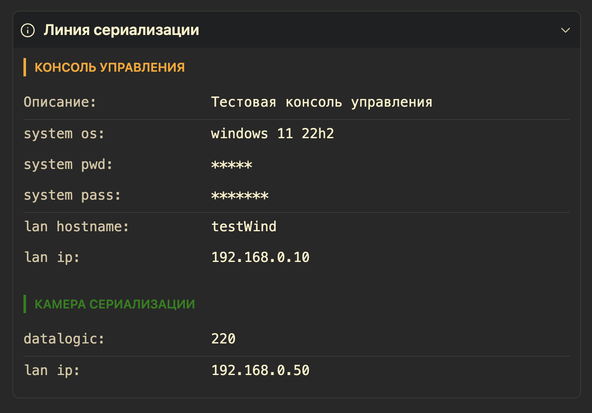

# inventory-obsidian
Structured data from YAML blocks in the form of an interactive inventory with support for password hiding.

# RU
Отображает структурированные данные из YAML-блоков в виде интерактивного инвентаря.



## Особенности
- Группировка данных по секциям и элементам
- Автоматическое скрытие полей с паролями
- Копирование значений по клику
- Кастомизация цветов через YAML-параметры
- Поддержка русского и английского языков

## Установка
1. Откройте **Settings → Community plugins** в Obsidian
2. Найдите "Inventory" и нажмите **Install**
3. Включите плагин

## Ручная установка
1. Скачайте плагин с github [Скачать](https://github.com/azretik/inventory-obsidian/archive/refs/heads/main.zip)
2. Скопируйте его в папку вашего харнилища `хранилище/.obsidian/plugins`
3. Включите плагин в настройках Obsidian

## Использование
Создайте блок кода с языком `inventory`:
```
```inventory
"Секция":
  color: blue
  "Элемент":
    параметр: "значение"
    password: "секрет"
```

### Системные параметры
- `desc` - описание секции или элемента
- `background` - цвет секции
- `color` - цвет текста секции или элемента
- `icon` - иконка (из obsidian) для секции

## Основная идея
- лаконичный интерфейс
- удобство использования
- возможность закрывать корень под спойлер
- сокрытие полей pwd password pass secret pin пароль пин секрет
    - клавиши показать/скрыть
- возможность копирования значения поля по клику
- иконки - использование стандартных иконок obsidian
- спойлеры - по возможности базовые расцветки obsidian ???
- языковая поддержка

## К реализации
- сохранение состояния спойлера секции
- поддержка background в элементах, коллекциях и объектах